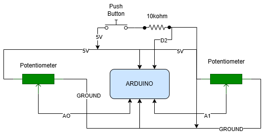

# Interactive Animated Circle Sketch with Arduino Integration

This project merges the physical world with digital art, combining the power of p5.js and Arduino. It features an interactive sketch that dynamically responds to user input via potentiometers and a button. Users can manipulate the sketch's visual elements and behavior, such as the size of circles, their movement, and background color, all in real-time.

# Circuit Diagram:

  

## Features

- **Arduino Integration**: The project uses an Arduino board to capture real-time input from two potentiometers and a button. The potentiometers adjust the sizes of the circles, while the button toggles between two modes:
  - **Color Change Mode**: The background color changes randomly each time the button is pressed.
  - **Static Mode**: Displays a static grid of circles where the potentiometer values adjust the sizes of the circles.
  
- **Interactive Animation**: After 10 seconds of static mode, the sketch automatically transitions into an animated mode where circles start to move and pulse based on the potentiometer inputs.

- **User-Controlled Input**: 
  - Adjust the size of the circles using the potentiometers.
  - Control the background color change by pressing the button.

- **Dynamic and Static Modes**: The sketch alternates between a 10-second static mode, during which the user can freely adjust the circle sizes, and an animation mode, where circles start moving and pulsating.

- **Responsive Design**: The sketch adjusts to the user’s input and visual preferences in real-time, allowing for a personalized experience based on the potentiometer values.

## How It Works

### Arduino Setup

The Arduino board serves as the input device, gathering data from two potentiometers and a button. The potentiometers are connected to analog pins A0 and A1, while the button is connected to digital pin 2. This data is transmitted to the p5.js sketch via serial communication.

### p5.js Sketch

In the sketch, a grid of circles is drawn, and their sizes are determined by the values received from the potentiometers. The background color and circle animations are controlled by these values as well.

- **Static Mode**: For the first 10 seconds, the sketch shows a static grid of circles. During this time, the user can adjust the sizes of the circles using the potentiometers.
- **Animation Mode**: After 10 seconds, the circles begin to move and pulse, creating an engaging visual effect. The movement speed and pulsating effect are influenced by the potentiometer values.

### Button Controls

- **One-time Button Press**: Changes the background color randomly, adding an element of surprise and interaction.
- **Two-time Button Press**: Returns the sketch to the 10-second static mode, allowing the user to reconfigure the circle sizes.

## User Interaction

1. Upon loading the sketch, the user will see a grid of circles in a static display for the first 10 seconds. The potentiometers control the sizes of the circles.
2. After the 10-second static mode, the sketch enters the animation mode, where the circles start moving and pulsating according to the potentiometer values.
3. Press the button to toggle between modes:
   - **One-time press**: Changes the background color.
   - **Two-time press**: Resets the sketch to static mode for reconfiguration.

## Key Concepts

- **Serial Communication**: This project demonstrates how to use serial communication between an Arduino and p5.js to pass real-time sensor data. The Arduino sends potentiometer values and button state to the sketch, which dynamically updates the visuals.
- **State Management and Timing**: The sketch utilizes `millis()` to manage timing and states. It begins with a 10-second static period, then transitions into animation mode, with user interactions (button press) controlling the state transitions.
- **Real-Time User Input**: The potentiometers control the size of the circles and the speed of their movement, making the user an active participant in the visual experience. The button press adds another layer of interactivity by changing the sketch’s behavior.

## Installation and Setup

To run this project, follow these steps:

1. **Hardware Setup**:
   - Connect two potentiometers to analog pins A0 and A1 on your Arduino.
   - Connect a button to digital pin 2.
   - Ensure the Arduino is properly powered and connected via USB.

2. **Software Setup**:
   - Clone this repository or download the project files.
   - Open the `index.html` file in your browser. Ensure that you have the necessary p5.js and serialport.js libraries linked.
   - Modify the serial port in the p5.js sketch to match the correct port for your Arduino (e.g., `COM12`).
   - Upload the Arduino code to your board.

3. **Run the Sketch**:
   - After setting up the Arduino and p5.js sketch, you can open the browser and interact with the sketch. Adjust the potentiometers to change circle sizes, press the button to toggle between color modes, and watch the sketch animate after the static period.

## Acknowledgements

- **p5.js**: This creative coding library is used to handle the animation and graphics rendering in this project.
- **Arduino**: Arduino's simple interface allows easy integration with sensors and external devices, which makes this project possible.
- **p5.serialport**: This library is used to enable serial communication between the Arduino and p5.js, making real-time interaction possible.

# Conclusion
This project demonstrates the power of combining physical computing with creative coding to create interactive and dynamic experiences. By using real-time sensor data from the Arduino, the user can manipulate both visual elements and the behavior of the sketch, making it a highly customizable and engaging project.
